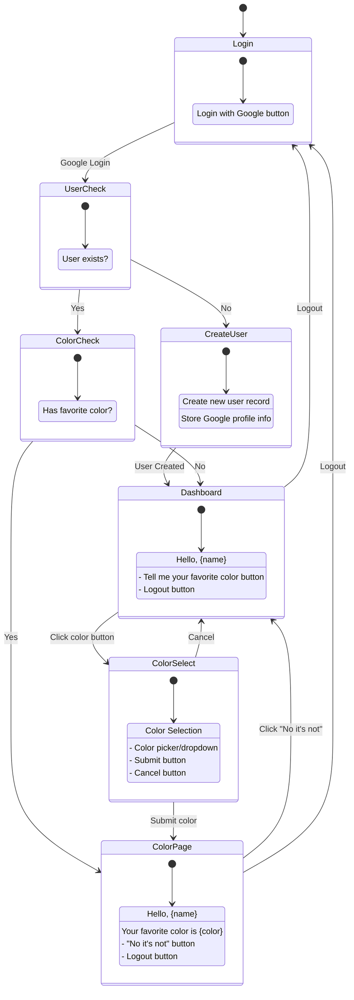

# AI-accelerated social login

This is project exists strictly to satisfy my curiousity about how much AI could accelerate getting a simple app up and running. I'd used AI to tune bits and pieces here and there, but hadn't really built anything from start to finish. Feel free to poke around if you're interested, but I wouldn't advise running it in production. If code worked as spit out by the LLM, I left it as it was.

Somewhat arbitrarily I decided I wanted to foist authentication off on Google, which actually turned out to be one of the more painful parts of the process because Google asks you to jump 
through a bunch of hoops to ensure you're not just some rando using their service for a toy project. So maybe don't use that if it's not something you really need.

## Other arbitrary rules:
1. I wanted to use mostly tools I'd used before, but not the tools I was most comfortable with.
2. I wanted to minimize my use of the AWS console and use IaC (specifically terraform) wherever possible.
3. I wanted to run containers in AppRunner to see what I'd lose vs k8s (other than a lot of headaches).
   
The 5-minute flow I scratched out looked like this:

## Tools
1. Terraform
2. Docker
3. App Runner
4. React
5. Flask
6. DynamoDB

I was planning on using Cognito as well, but it's not free within LocalStack, so it got cut.

## Thoughts?

1. Generally this worked much better than I expected. I know this isn't an original thought, but the improvement in these tools over the last 6 months is impressive.
2. This is 80% of the benefits of pair programming with < 1% of the cost. 
3. Claude's Sonnet model was a standout and is what I used 90% of the time (both on its own and via Windsurf). When I pushed back on things that didn't make sense, it was quickest to course correct. Copilot I found more or less worthless (for being built into the IDE it's shockingly unergonomic and none of its first 4 suggestions would compile). ChatGPT was way too chatty out of the box. I don't need 17 different options and the next 12 steps. 
4. It's amazing for all the things that need to be done once and only once for a new project. The stuff I need to look up every time.
5. Talking it through design changes is exhausting. It took 4 or 5 turns to get it to stop using the default (ugly) color picker. What finally worked was giving it a sample screenshot. So maybe don't fire all your designers yet.
6. You still need to know enough about programming to stop it from doing silly things. Frequently I had to say "shouldn't this go into terraform?" or "doesn't it make more sense to use a single approach for managing environment variables?" or whatever else. If you're just doing what it tells you to without applying a filter, you're 5 minutes away from an unmaintainable mess. I do think this leads to an interesting thought experiment. If LLMs are going to completely replace programmers, I think it's going to be writing code that is completely impossible for a human to maintain. Just a hot mess of spaghetti code, dead code, jammed together concerns, etc. But if no human ever has to touch it, that may not matter.

## Also

If nothing else comes from this, I was thrilled to find [mermaidjs](https://mermaid.js.org/) when I asked Claude to draw me some diagrams. I am painfully uptight about diagrams, and this is going to save me an immeasurable amount of time with Lucidchart/drawio.
